# Lab1

- Verification de l'integrite 

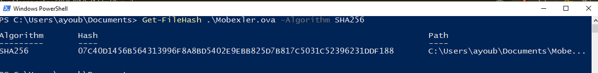 

Identification de Reseau , adapter 1 et 2 : 

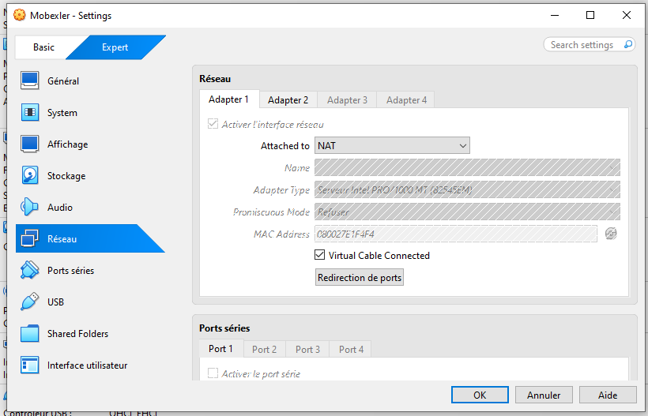

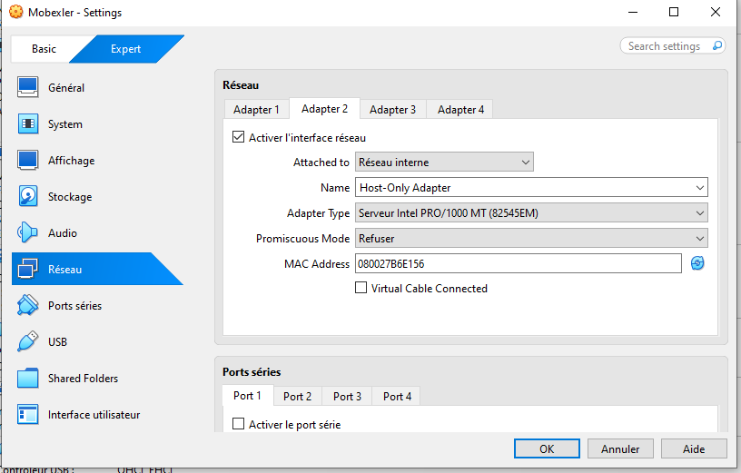

- Demmarrage de la VM Mobexler :

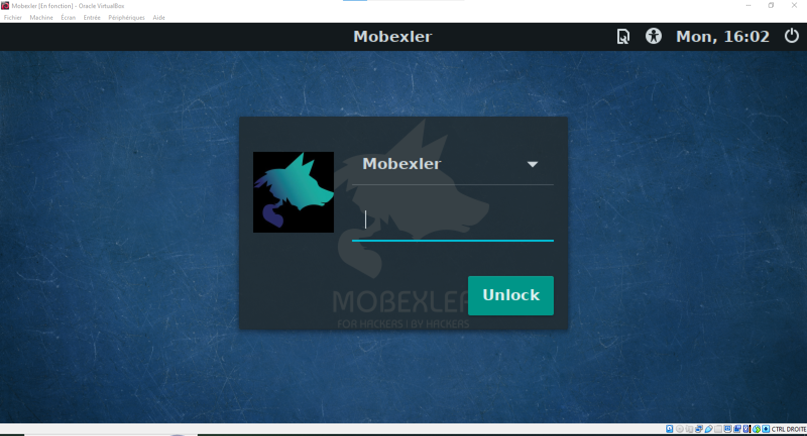

- Verification de L'IPs , avec l'identification des interfaces NAT et Host-Only :

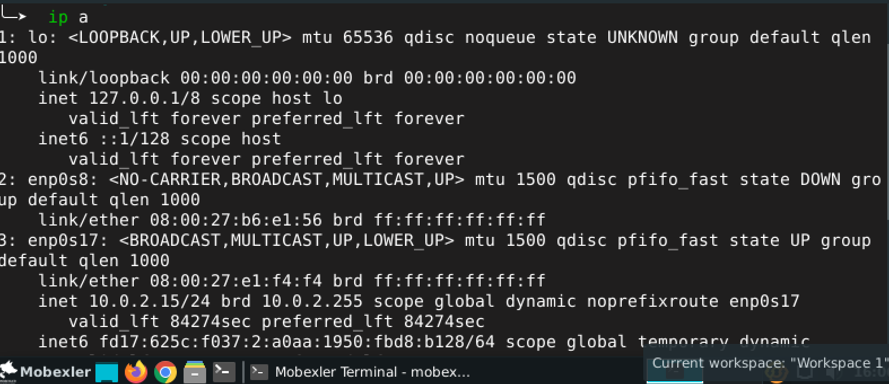

Pour le NAT : enp0s17 : 10.0.2.15 ( UP ) 
Pour Host-Only : enp0s8 ( DOWN ) 

- Verification des routes :

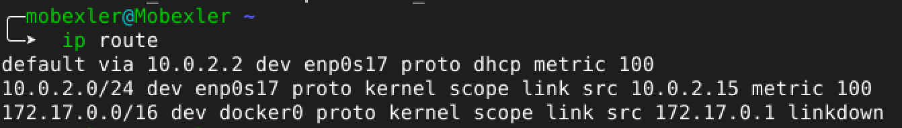

- Test d'Internet :

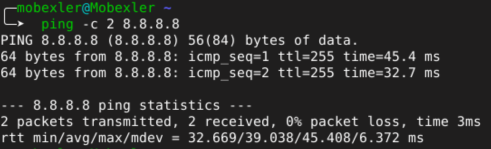

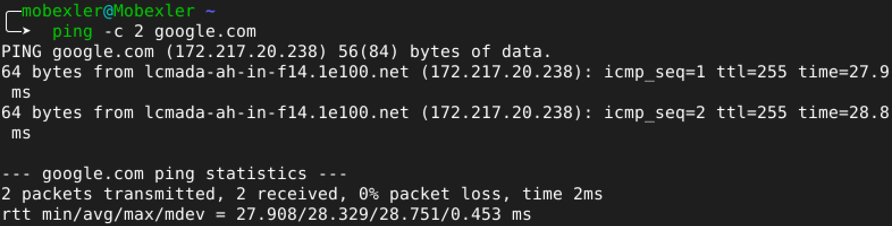

- La creation du Snapshot :

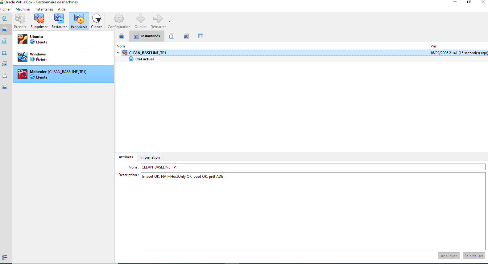 

- Donc on va activer loption pour les developpeur + USB debbuging :

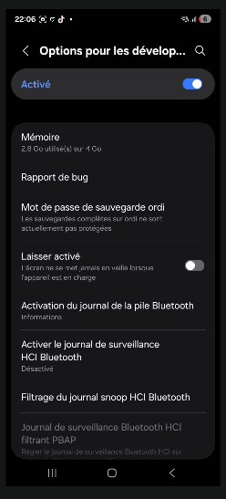 

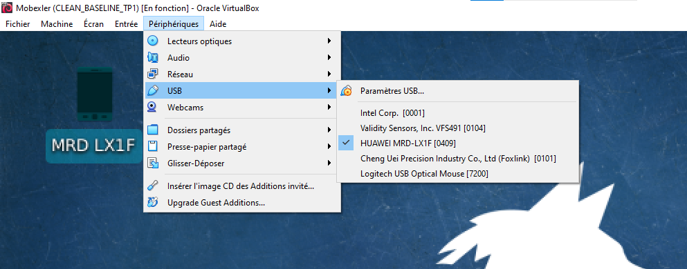 

- Verifictaion ADB dans Mobexler , le device n'affiche pas le peripherique , mais il est bien lien en USB :

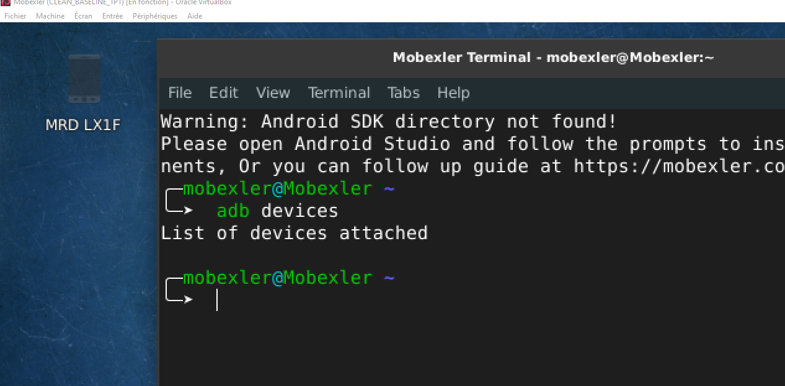 

